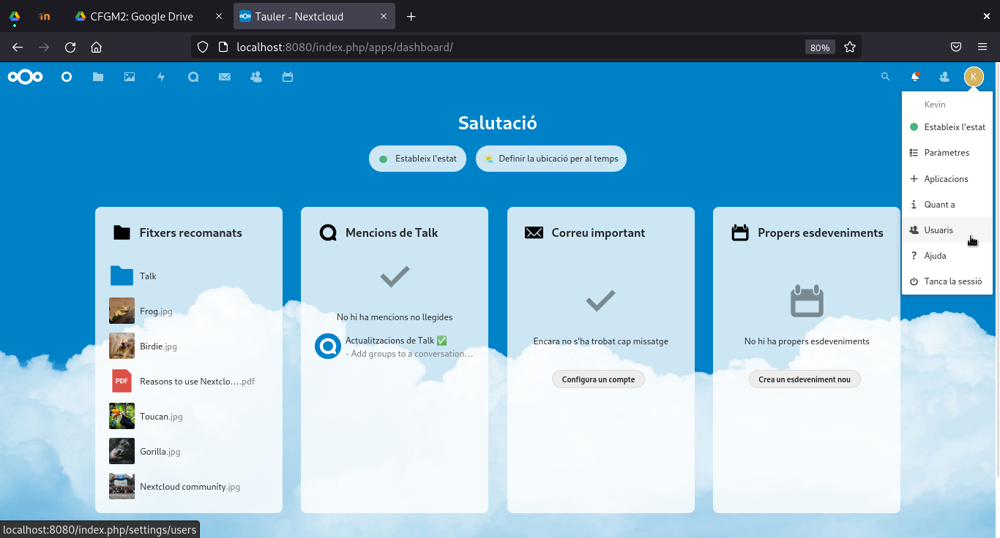

# **Manual Configuración Nextcloud**
## **Configuración**

Lo primero que vemos en la configuración es la pantalla de entrada del NextCloud, la cual se ve de esta forma:

Desde este menu, podemos hacer multiples cosas, pero aqui solamente veremos una de ellas, que es el siguiente apartado...

## **Creación de Usuarios**

Para crear usuarios debemos acceder a su menu de la siguiente forma

AL acceder, este se vera de la siguiente forma:

Para crear el usuario, debemos darle click a esta zona de aqui, tras eso se tendra que rellenar los siguientes datos

Una vez los datos rellenados, le damos a nuevo usuario y este, nos saldra de la siguiente forma:

## **Administración de archivos**

Para crear una carpeta o archivo, debemos darle click al simbolo del `+` y nos saldran estas opciones:

Con el archivo creado, si le damos a los puntos conectados con lineas llegaremos al siguiente submenu:

En este, podemos añadir un grupo o persona con la que compartirlo, y editar sus permisos.

Con esto finaliza la creación de los usuarios, y el manual de configuración.
