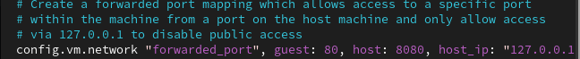
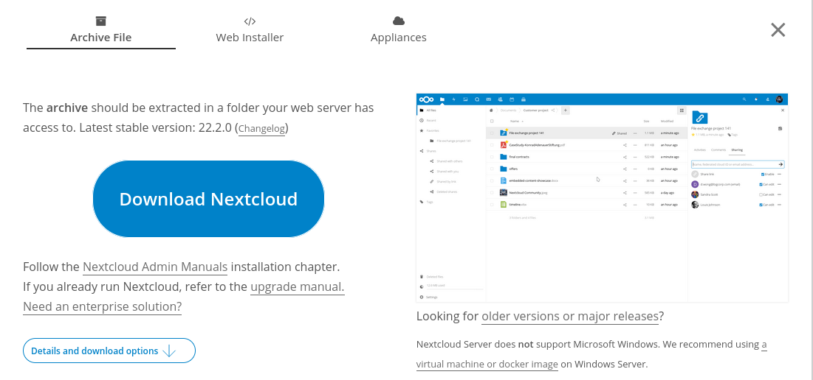

# **Manual Instalación Nextcloud**
## **Instalación**
## **Vagrant**

Empezaremos explicando un poco lo que nos interesa de Vagrant. Este software nos permite hacer uso de maquinas virtuales, sin que consuma tantos recursos. Su funcionamiento es sencillo. Lo primero que debemos hacer es la siguiente orden:
```
vagrant init ubuntu/focal64
```
Esto nos generara un archivo de vagrant que nos hara falta para poder ejecutar las maquinas virtuales. En este archivo, debemos entrar con vi, e cambiar un parametro que necesitaremos más adelante. Esto es sencillo, solo hay que poner la siguiente orden, y modificar como la imagen adjunta el archivo:
```
vi Vagrantfile
```

Una vez hecho esto, debemos poner las siguientes 2 ordenes, y tras eso iniciamos la maquina.
```
vagrant up --provider=virtualbox
```
## **Dentro de la maquina**

Lo primero que debemos hacer es instalar en la maquina el software de `Apache2` y el de `Mysql`. Como añadido podemos instalar las bibliotecas extra de apache 2.

Los comandos para instalarlo son los siguientes:

```
apt update
apt upgrade
apt install -y apache2
apt install -y mysql-server
apt install -Y php libapache2-mod-php
apt install -Y php-fpm php-common php-mbstring php-xmlrpc php-soap php-gd php-xml php-intl php-mysql php-cli php-ldap php-zip php-curl
apt install -Y unzip
```
Una vez todo este descargado, procedemos a reiniciar el servicio de Apache2, hacerlo es tan simple como poner la siguiente orden:
```
systemctl restart apache2
```

Ahora debemos comprobar si el servidor apache2 funciona, si es asi lo siguiente que hay que hacer pasar a la siguiente categoria:

#### **Acceso al MySQL**
```
mysql -u root
```

Una vez dentro, crearemos nuestra base de datos y usuario en MySQL de la siguiente forma:

#### **Creación de la base de datos:**
```
CREATE DATABASE [NombreBaseDatos]];
```

#### **Creación de un usuario**

```
CREATE USER '[NombreUsuario]'@'localhost' IDENTIFIED WITH mysql_native_password BY '[NombreContraseña]';
```

Tras tener creado el usuario, le tendremos que dar permisos de root, para que este pueda administrar a los demas usuarios. Esto se debe hacer con la siguiente orden:

#### **Dar privilegios al usuario:**
```
GRANT ALL ON [NombreBaseDatos]].* to '[NombreUsuario]'@'localhost/[IpMaquina]';
```

#### **Salida de la base de datos**
```
exit
```

Una vez todo creado, debemos comprobar si lo hemos hecho bien, por ello haremos lo siguiente:

#### **Conectarse a la base de datos**

```
mysql -u [NombreUsuario] -p
```

Con la comprobaración hecha, solo nos quedaria reiniciar el servidor de la siguiente forma:

```
systemctl restart mysql
```

Ahora lo que haremos sera descargar la aplicación web en la maquina. (En este caso se trata del Nextcloud) Hay 2 formas de instalarlo, y dependen de la maquina en la que se a hecho la instalación.

#### **Caso Vagrant**

En el caso de Vagrant es bastante sencillo, solamente debemos descargar la aplicación en nuestra maquina original y moverlo al directorio donde tenemos la maquina, una vez hecho la maquina debera acceder a ese directorio y ya podra ir al siguiente paso, pero para acceder debera poner la siguiente ruta:

```
cd /Vagrant
```

Cuando accedemos lo unzipeamos sin dificultad, y lo añadimos a la ruta `/var/www/html`, y ahi lo unzipeamo. Pero... ¿Como se hace? Pues, siguiendo estas ordenes:
```
mv [NombreFichero] /var/www/html
cd /var/www/html
unzip [NombreFichero]
```

#### **Caso Contenedor**

Desde un contenedor la cosa se complica un poco más, en este caso debemos copiar el link (https://www.google.com/url?q=https://nextcloud.com/install/%23instructions-server&sa=D&source=hangouts&ust=1636614406268000&usg=AOvVaw1j2cI6yzaQs1-B7d5cCbHT), y pegarlo en el contenedor para que se descarge directamente en este. El comando para ello es tan simple como:

```
cp ~/Baixades/[Aplicación] ~/[Nombre carpeta] cd ~/[Nombre Carpeta] unzip [Aplicación].zip
```

### **Para finalizar**
Y ya por ultimo, debemos eliminar el index.html que hay en este directorio, y sustituirlo por todo el contenido que contiene el zip del cloud. Para hacerlo, debemos seguir el siguiente orden de los comandos:
```
rm index.html
cd nextcloud
mv * /var/www/html/
```

Lo ultimo ulimisimo que debemos hacer es dar permisos, para ello, ponemos los siguientes comandos, y comprobamos que todo funciona correctamente:

```
chmod -R 775 .
chown -R root:www-data .
```

## **Una vez todo esto finalizado, debemos entrar en LocalHost:8080, y insertar los datos en esta imagen**


A partir de aqui pasamos al manual de configuración.
