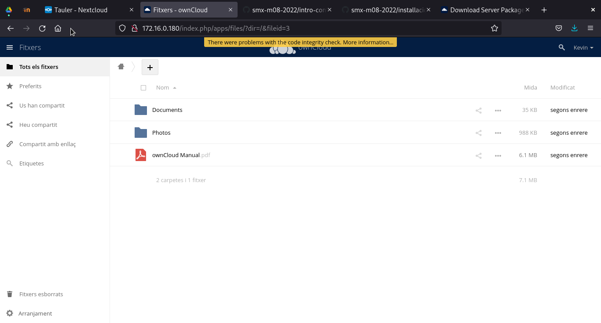
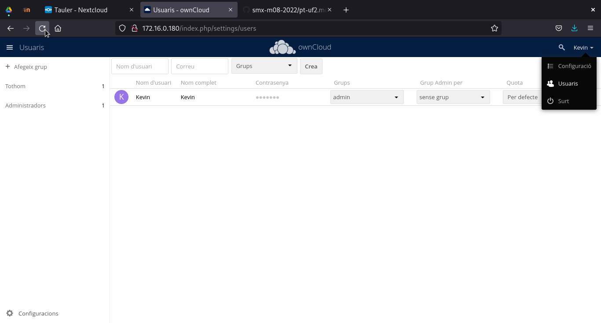
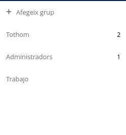
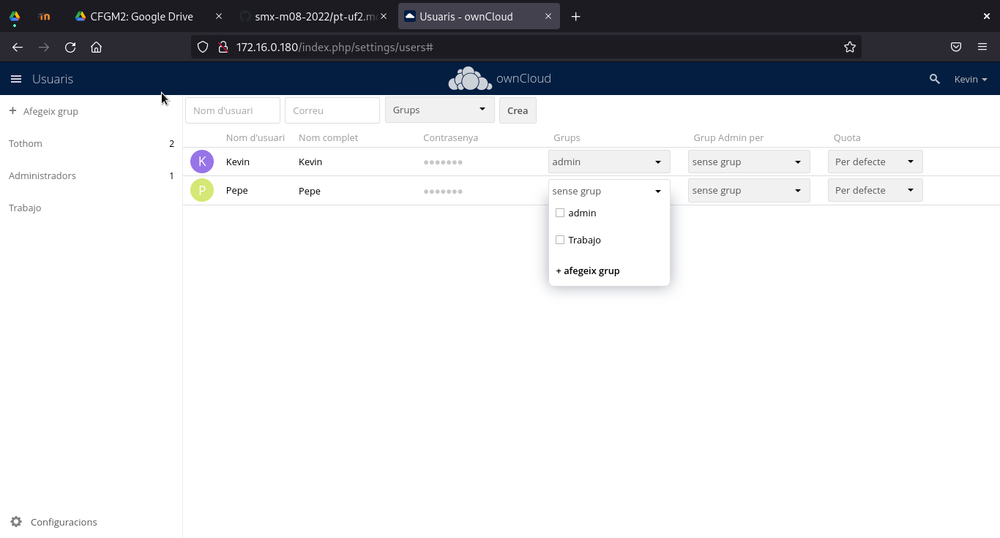
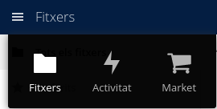
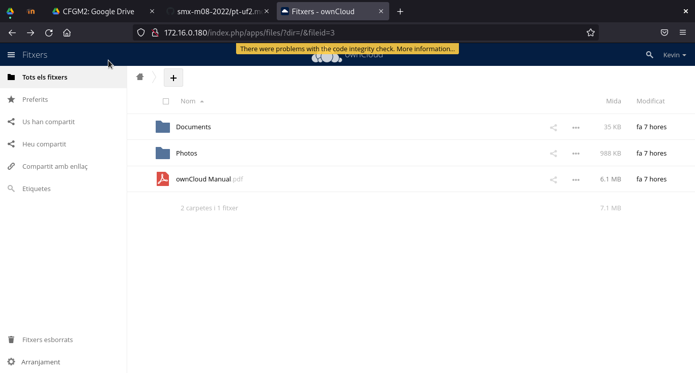
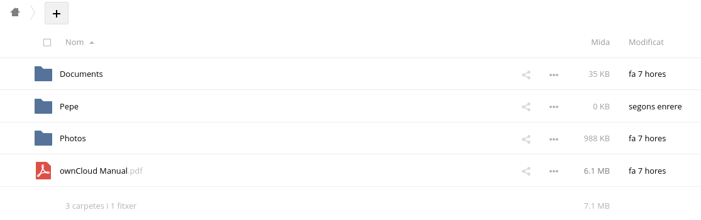
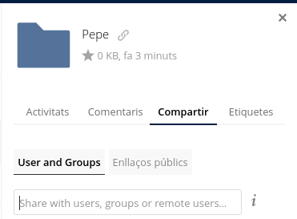
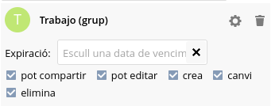
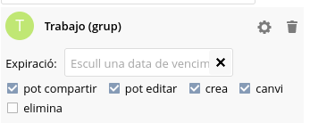

# **Manual Configuración Owncloud**
## **Configuración**

Lo primero que vemos en la configuración es la pantalla de entrada del OwnCloud, la cual se ve de esta forma:

A partir de aqui lo que podemos hacer son varias cosas que se explicaran en este manual, empezando por lo simple...

## **Creación de ususarios**

Para crear usuarios debemos darle click a nuestro nombre de usuario, y ir al apartado de usuarios que se aprecia en la captura adjunta:

Además, en la captura se puede visualizar el menu de creacion de usuarios y grupos. Para crearlos hay que rellenar este apartado, y darle a crear:

### **Creación grupos**

Desde el mismo menu que los usuarios, también podemos crear grupos, y se hace dandole a la siguiente opción y la rellenais:

al crearlo, podemos comprobar que existe en la lista que se encuentra justamente abajo:

Y para añadir a un usuario a un grupo, solamente debemos seguir los siguientes pasos de las imagenes:

## **Gestion de archivos**

Para gestionar tus archivos, o carpetas, lo primero que debemos hacer es acceder a la parte de los archivos. Para ello debemosdarle click a las 3 barritas y ir a ficheros

Este sección se debe ver de la siguiente forma:

Desde este menu podemos crear carpetas, archivos, o hasta subir los nuestros desde el equipo local. Además de tener acceso a los que esten compartidos, pero vayamos por pasos...

### **Creación Carpetas-Archivos**

Para poder crear una carpeta debemos darle click al signo del `+`, y darle a la opcion de la carpeta como en la imagen adjunta:

Como se aprecia en la imagen, también se puede crear un fichero de texto o subirlo desde nuestro equipo local; Esto se hace dando click a esas opciones.

Para comprobar que a funcionado la creación de la carpeta, nos debera aparecer junto a las demas

### **Compartir Carpetas**

El OwnCloud nos permite compartir carpetas entre usuarios, y esto es bastante sencillo de hacer. Lo primero que debemos hacer es darle a los 3 puntos con lineas al lateral de la carpeta, y darle a compartir.
Nos debe salir la siguiente pestaña:

En el campo `User and Groups` añadimos los usuarios o grupos a los que se lo queremos compartir y listo.

## **Asignación de permisos y roles**

### **Permisos**

Con la compartición de la carpeta podemos observar que el grupo trabajo tiene todos los permisos activados, pero ¿Como se desacivan? Esto es muy sencillo, solamente debemos darle click a la casilla del permiso que le queremos sacar, un ejemplo:

Con todos los permisos:

Sin el permiso de eliminar:

También se observa que se puede poner un perioro de expiración, pero esto no es de gran interes para nosotros.

Esto en los ficheros funciona de la misma forma.

Tambien se puede limitar el tamaño que tienen los usuarios en su OwnCloud, esto se hace desde el apartado de `quote` en usuarios (Se pude ver más arriba)

### **Roles**

Los usuarios tienen distintos roles dependiendo su grupo, por ejemplo, mi usuario `Kevin` tiene el rol de `Administrador`, mientras que el usuario de `Pepe` tiene el rol de `Usuario Estandart`

Por ejemplo, es posible crear un usuario `Invitado` que tenga menos derechos que un propio usuario.
