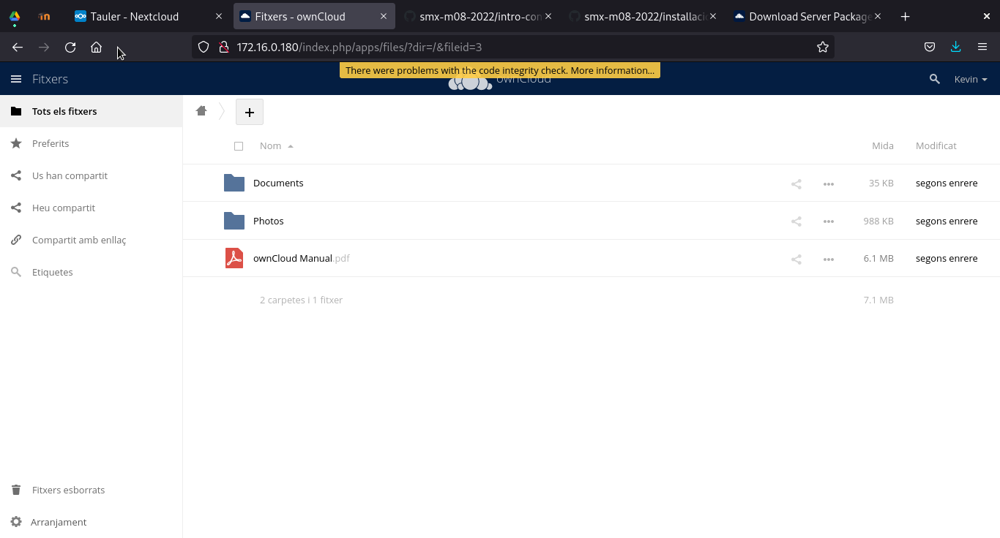

# **Manual de Instalación del Owncloud**

Lo primero que se ha de hacer es crear un contenedor en el que elaboraremos la Instalación. Para crearlo debebos hacer uso de la comanda lxc. Especificamente haremós

```
 lxc launch ubuntu:20.04 [Nombre que le quieras poner al contenedor]
```

Para verificar si esta o no activo tendras que listarlo, y para ello hay que usar el comando:

```
lxc list
```

Si esta activo tendras que entrar en él {Se explica mas adelante} pero si esta desactivado tendras que activarlo. Para ello haremos uso del comando:

```
lxc start [Nombre Contenedor]
```

Una vez ya iniciado debemos entrar en el contenedor para proseguir con los pasos necesarios para la instalación. EL como entrar es muy sencillo, solo se debe hacer uso del siguiente comando:

```
lxc exec [Nombre Contenedor] bash
```

### Dentro del contenedor

Una vez ya estamos dentro debemos instalar varios paquetes, estos paquetes son:
{Recuerda que antes de instalar paquetes hay que hacer update}

```
apt install -y apache2
apt install -y mysql-server
apt install -y php libapache2-mod-php
apt install -y php-fpm php-common php-mbstring php-xmlrpc php-soap php-gd php-xml php-intl php-mysql php-cli php-ldap php-zip php-curl
```

Una vez descargados e instalados los paquetes, lo que haremos sera iniciar un modulo, y una configuración de apache2

#### modulo

```
a2enmod proxy_fcgi
```

#### configuración

```
a2enconf php-fpm
```

Una vez activado esto hay que reiniciar el servicio de apache2, ya que sino, los cambios no se aplicaran.

```
systemctl restart apache2
```

Tras esto pasamos al siguiente punto.

### mysql

Lo primer que haremos es acceder al MySQL que anteriormente hemos descargado como root.

```
mysql -u root
```

Una vez dentro del mysql, crearemos una base de datos, para ellos se usa el comando:

```
CREATE DATABASE [Nombre de la base de datos];
```

Una vez creada la base de datos debemos crear un usuario, y a este, se le daran privilegios de root.

```
  CREATE USER 'Nombre del usuario'@localhost IDENTIFIED WITH mysql_native_password BY 'Contraseña que quieras agregar';
```

```
GRANT ALL ON [Nombre base de datos].* to [Nombre de usuario]@localhost;
```

Tras esi salimos con el comando Exit y comprobamos si todo a ido bien mediante el comando

```
mysql -u [Nombre usuario] -p
```

Tras esto lo que haremos sera sincronizar una carpeta del contenedor con una de la maquina fisica por el mero hecho de la comodidad. Para ello crearmos un par de claves del host con el siguiente comando:

```
ssh-keygen -f ~/.ssh/[Nombre contenedor] -n ""
```

Tras generarla querremos ver la clave, esta se encuentre en:

```
~/.ssh/[Nombre Contenedor].pub
```

Esta clave la tendremos que poner en el directorio `/root/.ssh/authorized_keys` con vi

Ahora en el host creamos una carpeta con el nombre de nuestro contenedor. Ya con eso, utilizas IP -C A para ver la ip, y sincronizas ambas carpetas, para ello se usa el comando:

```
sshfs root@[ip]:[Ubicación carpeta contenedor] [Ubicación carpeta host]
```

(Si todo a ido bien, dentro de la carpeta que has creado, debe aparecer el index.html que creamos con el apache2)

Ahora viene la parte final, esta es la descarga de la aplicación web.

### Instalación de la aplicación

Una vez con el programa descargado (En nuestro caso Owncloud) debemos moverlo a nuestra carpeta entre el contenedor y la maquina real.

```
cp ~/Baixades/[Aplicación] ~/[Nombre carpeta]
cd ~/[Nombre Carpeta]
unzip [Aplicación].zip
```

Una vez ya hecha la copia, le daremos permisos a toda la carpeta de `/var/www/html`

```
chown -R www-data:www-data /var/www/html
chmod -R 775 /var/www/html
```
Ahora, debemos entrar en el OwnCloud mediante la IP del contenedor, y esta se debe ver de la siguiente forma:



